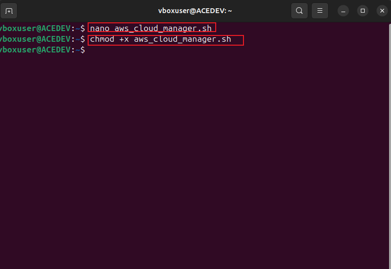
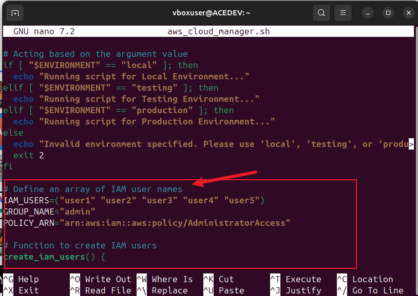
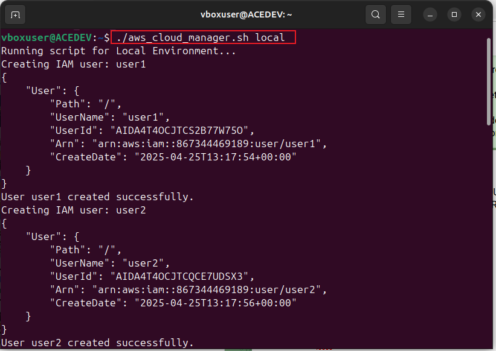
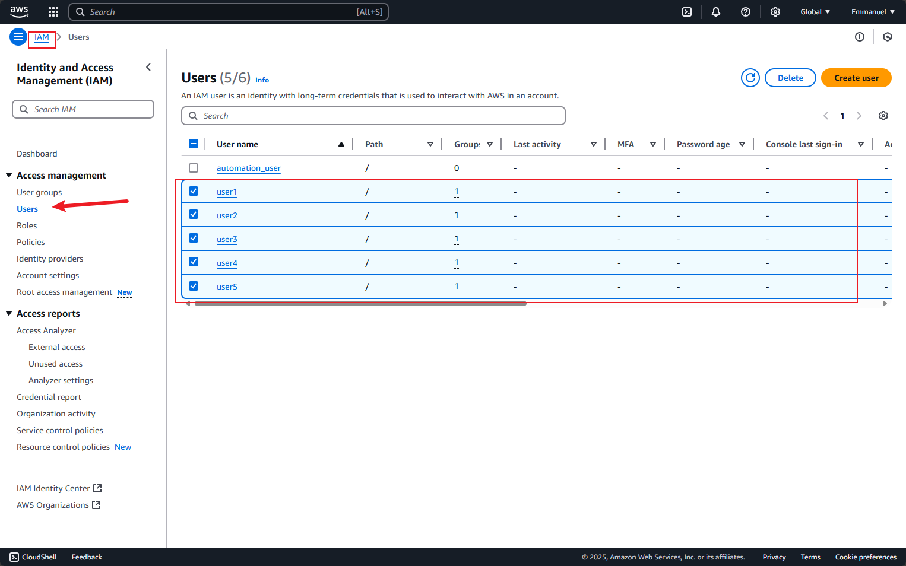
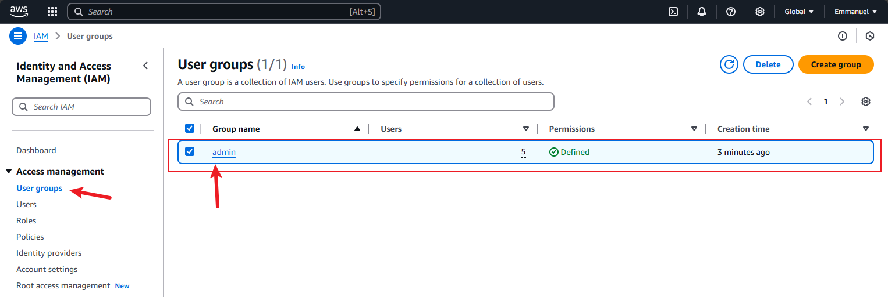
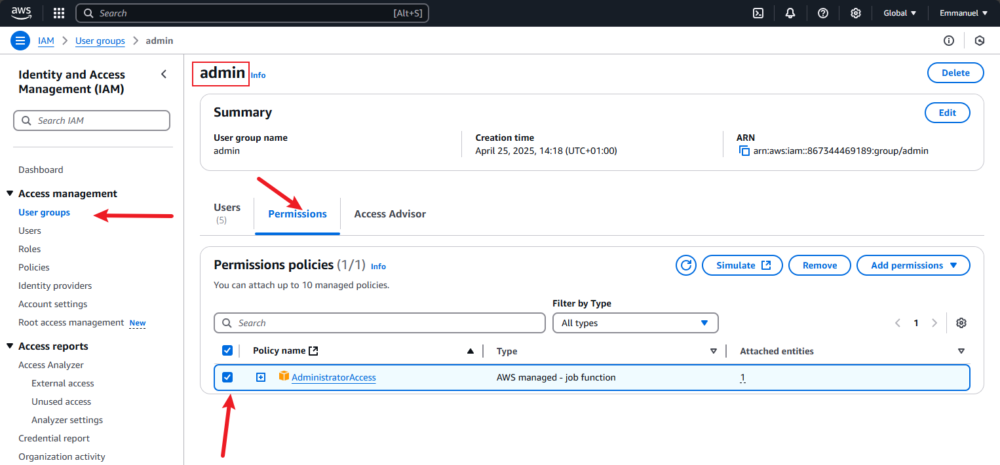
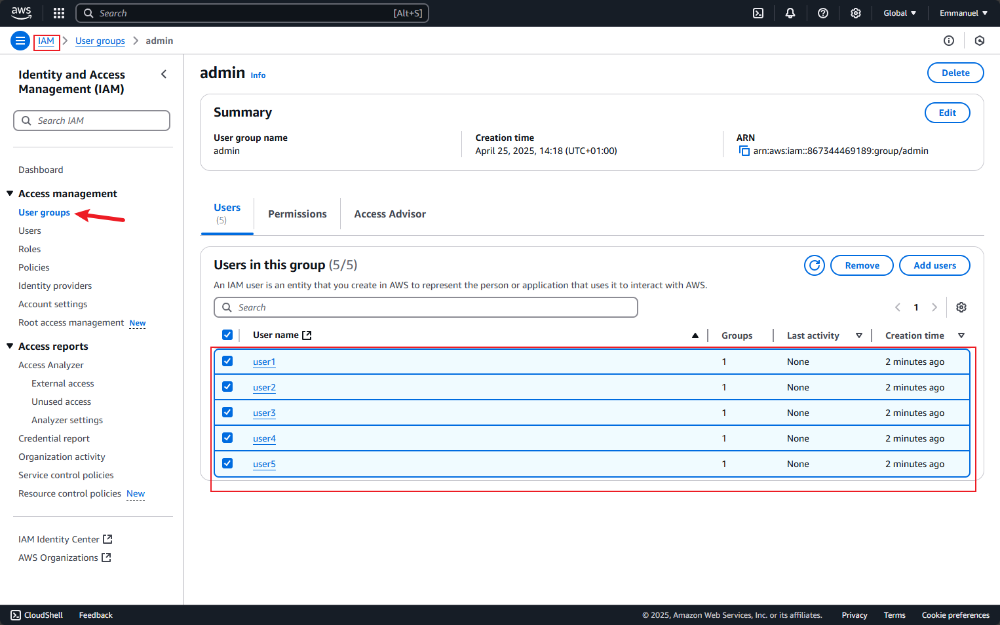

# Linux-Administration-and-Shell-Scripting
Automating tasks for  CloudOps Solutions, which has adopted AWS for cloud infrastructure.

Extending shell scripting skills for managing AWS Identity and Access Management (IAM) resources. 
OBJECTIVES :
* Enhance the Script: Build on an existing script ("aws_cloud_manager.sh") to include IAM user and group management.
* Create IAM Users: Store names of IAM users in an array and iterate through it to create users using AWS CLI commands.
* Define IAM Group: Create an IAM group named "admin" and attach an administrative policy to grant privileges.
* Assign Users to Group: Add users to the "admin" group via the AWS CLI.

# STEP 1
Enhance the Script: Build on an existing script ("aws_cloud_manager.sh") to include IAM user and group management.
previous script  ("aws_cloud_manager.sh") :
  
    !/bin/bash

    # Checking the number of arguments
    if [ "$#" -ne 1 ]; then
    echo "Usage: $0 <environment>"
    exit 1
    fi

    # Accessing the first argument
    ENVIRONMENT=$1

    # Acting based on the argument value
    if [ "$ENVIRONMENT" == "local" ]; then
     echo "Running script for Local Environment..."
    elif [ "$ENVIRONMENT" == "testing" ]; then
     echo "Running script for Testing Environment..."
    elif [ "$ENVIRONMENT" == "production" ]; then
     echo "Running script for Production Environment..."
    else
     echo "Invalid environment specified. Please use 'local', 'testing', or 'production'."
    exit 2
    fi

    #  extended code to fufill the objectives of the project :

    

    # Define an array of IAM user names
    IAM_USERS=("user1" "user2" "user3" "user4" "user5")
    GROUP_NAME="admin"
    POLICY_ARN="arn:aws:iam::aws:policy/AdministratorAccess"

    # Function to create IAM users
    create_iam_users() {
    for USER in "${IAM_USERS[@]}"; do
    echo "Creating IAM user: $USER"
    aws iam create-user --user-name "$USER" 2>/dev/null
    if [ $? -eq 0 ]; then
      echo "User $USER created successfully."
    else
      echo "User $USER may already exist or an error occurred."
    fi
     done
     }

    # Function to create IAM group
    create_iam_group() {
     echo "Creating IAM group: $GROUP_NAME"
    aws iam create-group --group-name "$GROUP_NAME" 2>/dev/null
    if [ $? -eq 0 ]; then
     echo "Group $GROUP_NAME created successfully."
    else
     echo "Group $GROUP_NAME may already exist or an error occurred."
    fi
    }

    # Function to attach policy to IAM group
    attach_policy_to_group() {
     echo "Attaching policy: $POLICY_ARN to group: $GROUP_NAME"
    aws iam attach-group-policy --group-name "$GROUP_NAME" --policy-arn "$POLICY_ARN"
    if [ $? -eq 0 ]; then
      echo "Policy attached successfully."
    else
      echo "Failed to attach policy."
    fi
    }

    # Function to assign users to group
    assign_users_to_group() {
    for USER in "${IAM_USERS[@]}"; do
      echo "Adding IAM user: $USER to group: $GROUP_NAME"
    aws iam add-user-to-group --user-name "$USER" --group-name "$GROUP_NAME"
    if [ $? -eq 0 ]; then
      echo "User $USER added to group."
    else
      echo "Failed to add user $USER to group."
    fi
    done
    }

    # Execute functions
    create_iam_users
    create_iam_group
    attach_policy_to_group
    assign_users_to_group

    echo "✅ IAM management tasks completed!"

# steps:
* edit the previous shell script (aws_cloud_manager.sh) using the nano commandnand making sure it is executable using "chmod"

* attach the shell script with the project objectives above

* run the extended script using "./" seeing it run successfully where it shows the objectives have been created successfully

* i go and verify the objectives on the AWS console which is the creation of IAM users which were named "user1, user2, user3, user4 and user5" :

* the next objective which was the creation of IAM group named "admin" 

* attaching an AWS-managed administrative policy to the "admin" group

* the last objective which is to assign all the IAM user "user1 to user5" created to the IAM group "admin"

Summary:
 The script now includes:
> Functions for creating IAM users.

> Group creation and policy attachment.

> Assigning users to the group.

This automation helps streamline the cloud resource management process for CloudOps Solutions, ensuring efficient user and privilege management